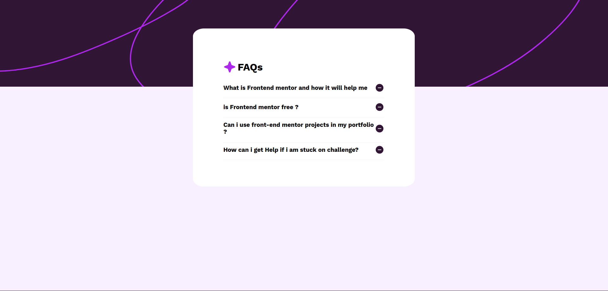

# FAQ Accordion Readme

## Description

This FAQ Accordion is a user-friendly interface that allows users to access a list of questions and their respective answers in an interactive manner. It incorporates several features for easy navigation and responsiveness across different devices.

## Features

### 1. Hide/Show Functionality

- **Description:** The answer to a question is hidden by default and can be revealed by clicking on the respective question.
- **Implementation:** Utilizes JavaScript to toggle the visibility of answers upon user interaction.

### 2. Responsive Design

- **Description:** The interface adjusts its layout based on the device's screen size for an optimal viewing experience.
- **Implementation:** Utilizes CSS media queries and responsive design principles to ensure adaptability across various screen sizes.

### 3. Hover and Focus States

- **Description:** Interactive elements within the interface have clear hover and focus states for enhanced user experience.
- **Implementation:** Customized CSS styles applied to elements to denote interactive states when hovered over or focused on.

## Screenshot

## Compatibility

This FAQ Accordion is designed to be compatible with modern web browsers and supports a wide range of devices and screen sizes. 
